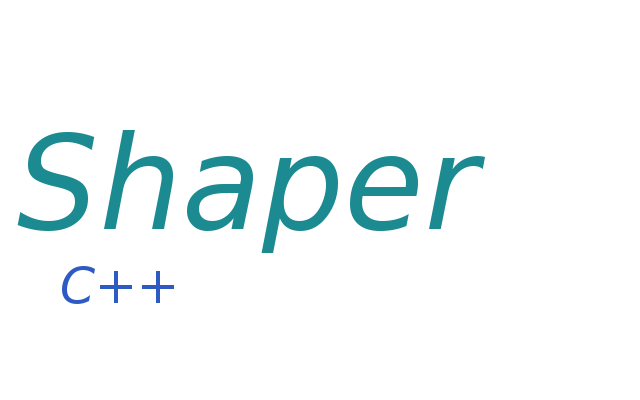

# shaper
Shaper

    Shaper is free software: you can redistribute it and/or modify
    it under the terms of the GNU General Public License as published by
    the Free Software Foundation, either version 3 of the License, or
    (at your option) any later version.

    Shaper is distributed in the hope that it will be useful,
    but WITHOUT ANY WARRANTY; without even the implied warranty of
    MERCHANTABILITY or FITNESS FOR A PARTICULAR PURPOSE.  See the
    GNU General Public License for more details.

    You should have received a copy of the GNU General Public License
    along with Shaper.  If not, see <http://www.gnu.org/licenses/>.

Why shaper?
    Shaper allows you to draw squares and rectangles with ease.
Documentation:
    ODF Text Document: [Absolute README link](/docs)
